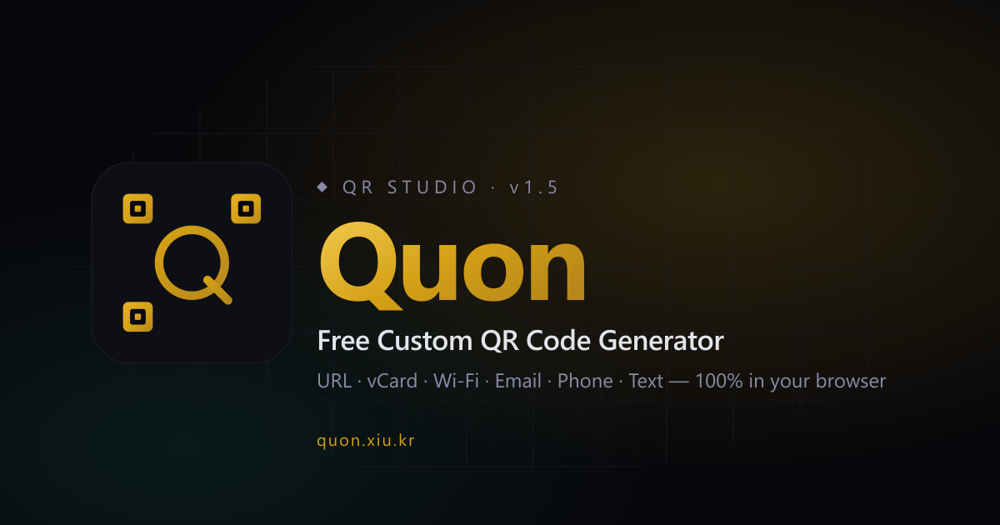

# Quon

**Free Custom QR Code Generator** — [quon.xiu.kr](https://quon.xiu.kr)

브라우저에서 즉시 만드는 맞춤형 QR 코드 스튜디오.
가입 없음 · 업로드 없음 · 100% 로컬 생성.

---

## 한눈에 보기

Quon은 URL·vCard·Wi-Fi 등 6가지 타입을 지원하는 다크 테마 QR 코드 생성기입니다.
내용을 입력하고 원하는 디자인을 고른 뒤, 한 번의 클릭으로 고해상도 PNG 또는 SVG를 받아보세요.
모든 생성은 브라우저에서만 일어나며, 데이터는 서버로 전송되지 않습니다.

## 주요 기능

### 6가지 QR 타입

| 타입 | 용도 | 특기사항 |
|---|---|---|
| **URL** | 웹사이트 · 랜딩 페이지 | 국제화 도메인 지원 |
| **텍스트** | 메모 · 문구 | 최대 ~2KB 원문 |
| **vCard** | 연락처 | RFC 2426 준수, iOS 호환, 비ASCII quoted-printable |
| **이메일** | 수신자 + 제목 + 본문 | mailto 문법 |
| **전화** | 국제 국가코드 선택 | tel: 스키마 |
| **Wi-Fi** | SSID + 암호 + 암호화 방식 | ISO/IEC 18004 Annex F, 특수문자 이스케이핑 |

### 맞춤 디자인

- 내장 디자인 프리셋 6종 + 사용자 슬롯 3개
- 도트 · 코너 · 배경 색상 개별 조정
- 중앙 로고 삽입 (PNG / JPG 업로드)
- 도트 모양 5종, 코너 스타일 3종

### 내보내기 & 히스토리

- 원탭 **PNG / SVG** 다운로드
- 파일명 자동 생성: `qrcode-<타입>-<타임스탬프>.<확장자>`
- 최근 생성 5개 자동 기록 + 즐겨찾기 고정 슬롯 2개
- 히스토리 검색 · 필터 · 정렬
- 데이터는 브라우저 `localStorage`에 보관 — 기기 밖으로 나가지 않음

### 프라이버시 & 성능

- 모든 QR 생성은 **브라우저 로컬** (서버 전송 0 바이트)
- 초경량 정적 사이트 — 빌드 번들 없음
- Lighthouse 고점수 (SEO · Performance · Accessibility)

### 다국어 · 접근성

- 한국어 / 영어 자동 감지 및 수동 전환
- `prefers-reduced-motion` 존중
- 키보드 네비게이션 전면 지원
- 스크린 리더 친화적 마크업

## 사용법

1. 상단 **타입** 탭에서 QR 종류 선택
2. 내용 입력
3. (선택) **Design** 탭에서 색상 · 로고 · 도트 모양 조정
4. **Generate** 버튼 → **PNG** 또는 **SVG** 다운로드

## 디자인

**Obsidian Gold** 다크 테마 — 자매 사이트 [xiu.kr](https://xiu.kr)과 동일한 디자인 토큰을 공유합니다. 골드 액센트(`#d4a016`), Syne × Outfit × Fira Code 타이포그래피, 그리드 + 라디얼 글로우 레이어, 점선 오빗 모티프.

## 라이선스

[MIT License](LICENSE) © XIU
